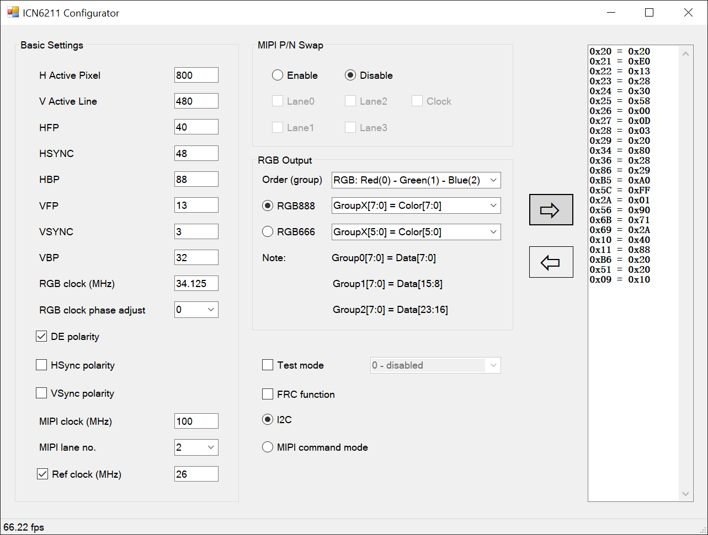

# ICN6211 Configurator
This repo contains popular ICN6211 MIPI-DSI to DPI bridge configurator written in C#.
Configurator has been written based on numerous forum discussions and blogs posts, mainly related to Linux kernel and drivers since detailed ICN6211 specification is not publicly available.

Please do not hesitate to share your comments and suggest improvements.

